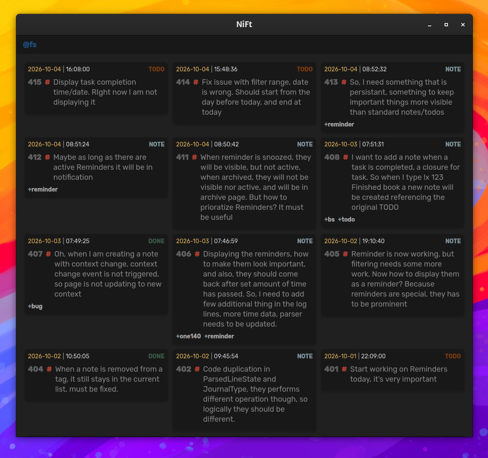
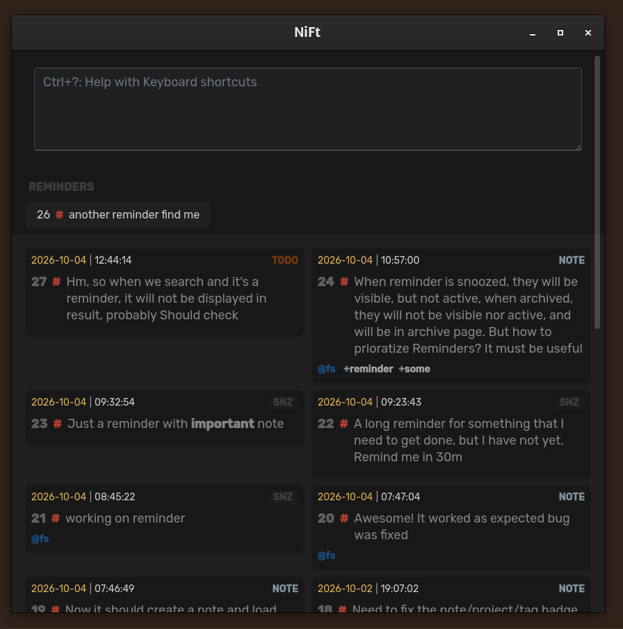
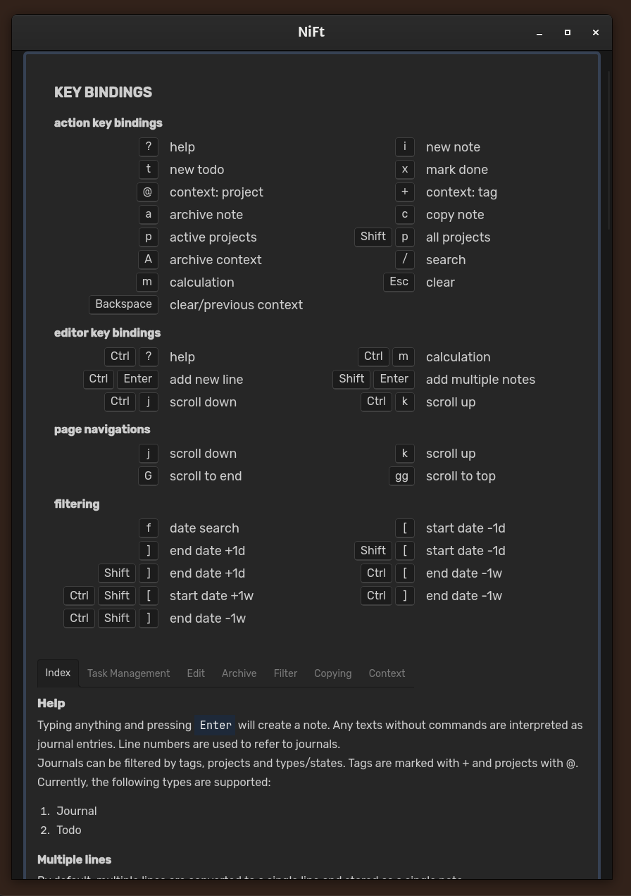
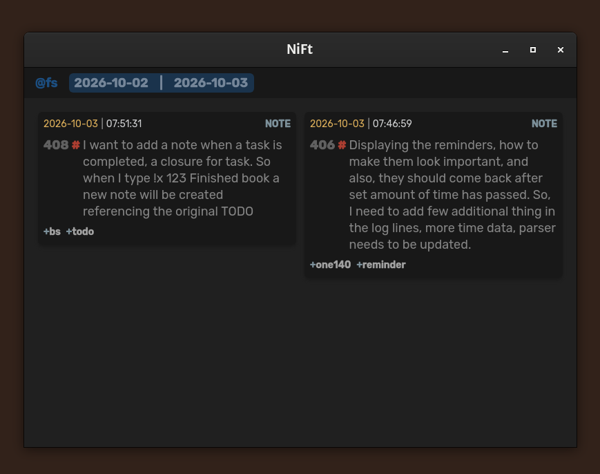
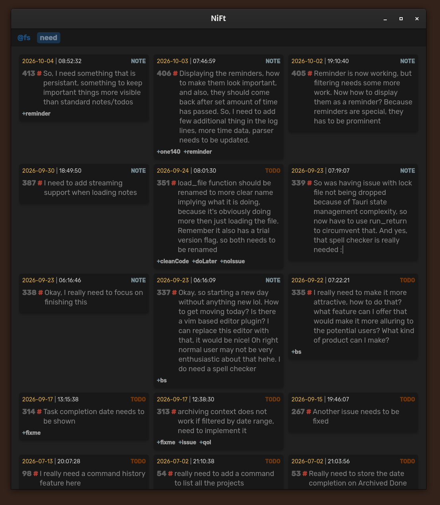
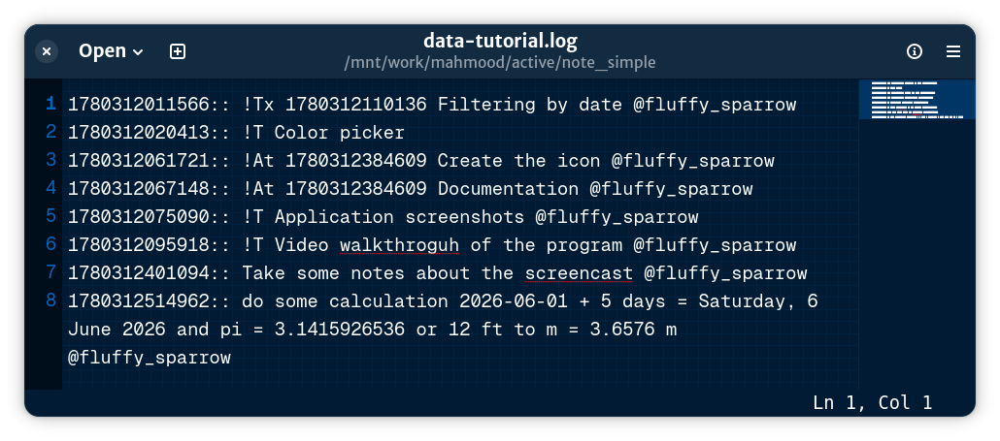

+++
title = "Nift, Simple, Minimalistic, Frictionless Note App"
date = "2026-10-05"
description = "There are many notes applications in the wild. But each one scratches different itches, and this one looks to take care of some, by being extremely simple, frictionless, minimalistic, while still packing quite the punch."
weight = 1

[extra]
local_image = "Nift/reminder.png"
tags = ["Rust", "TauriV2", "Note taking", "open data"]

+++

There are many notes applications in the wild. But each one scratches different itches, and this one looks to take care of some, by being extremely simple, frictionless, minimalistic, while still packing quite the punch. And also looks nice!

- [Download Demo](https://github.com/tmahmood/fluffy_sparrow/releases/tag/v0.1.14)
- [PRODUCT PAGE](https://tmahmood.gumroad.com/l/nift)
- [BUY](https://tmahmood.gumroad.com/l/nift?wanted=true)

One time purchase, $5. Initial Version, As Feature being added the price will increase 

## Features
So, what Nift can do to? Let's see!

The most important part of a note app is taking notes. And NiFT can make it quick and simple as open the app, type the note and enter, and done!

That's all you have to do! All the operations are simply done from this single text input. It does its best to be as frictionless as possible. But you can do a lot from a single text input!

Like
- writing down your todo, marking them done,
- creating reminders
- do many kinds of calculations quickly,
- search by text or filter by date range,
- unlimited undo.
- You can add tags or organize notes/todo in projects,
- archive unnecessary ones.

Documentation is available by pressing `?` or `Ctrl+h`.
All actions can be performed by keyboard shortcuts

You can filter notes by date, daily, weekly or monthly. Simply by using designated keyboard shortcuts, or commands
Fine tune filter range find notes quickly, only with keyboard.

Or perform searches.

## Core Principle
NiFt's core principle is making journaling as frictionless as possible. And, a lot of thought is put in to making it so, and still being done. It's handcrafted, without any LLM, and with a lot of care.

And many more features are coming! Like Time tracking, scripting, etc., with only one time purchase, that will cost you less than a month of coffee.

## Your data.
Data is stored in text format, on your device and completely open. Even in 100 years, or tomorrow, if this developer falls under the bus, you will have the application as long as you want. The format is easy to navigate and searchable using *nix commands.

It has no online features, no intention to have any; In the future, You can expect to have online interaction, through scripts written by you, but not the app itself.

Note: I do not have a Mac, so no Mac support, yet.

## Features

- Quickly create and edit single-line journals
- Filter by projects and tags
- Search journals
- Inline calculation
- TODO management
- Reminders
- Data are in plain text format, easy to navigate and search
- No external dependencies
- Lightweight, and minimal interface, fully customizable theme
